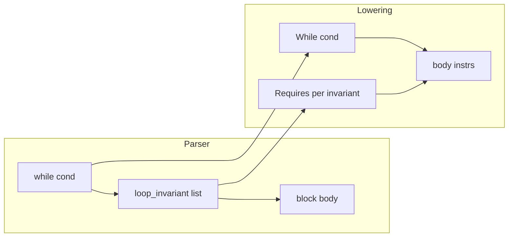

# Phase 4: loops, break/continue, while loop_invariant

## Scope (confirmed)

- **In:** `while`, `for x in lo..hi` (both bounds required, **half-open** `lo..hi` per [sv0doc/milestone-0-review.md](sv0doc/milestone-0-review.md) Q4: condition `__i < hi`), `loop { }`, `break` / `continue` (valueless only), **parser-retained** `loop_invariant(e)` list between `while` condition and body, lowered to `sv0_requires` at the **top of each iteration** (after C re-enters the `while`, same as plan text).
- **Out / explicit rejects:** `break expr` (loop result) — raise a clear **E04xx**; `for` with non-range iterator; `**loop_invariant` as an `ItemFn` contract** — keep **E0502** in `checkContract` (only `while`-attached invariants are supported in this phase).

## 1. AST and parser

- Change `[sv0c/src/ast/ast.sml](sv0c/src/ast/ast.sml)`: `ExprWhile` from `(cond, body, span)` to `**(cond, loop_invariants : expr list, body, span)`** (empty list when none).
- Refactor `[sv0c/src/parser/parser.sml](sv0c/src/parser/parser.sml)`: replace discard-only `parseLoopInv` with `**parseLoopInvList`** that returns `expr list * token list` (repeat `loop_invariant ( expr )`); wire into `parseWhileExpr`. Update `exprSpan` for `ExprWhile`.

## 2. Name resolution

- `[sv0c/src/name_resolution/resolver.sml](sv0c/src/name_resolution/resolver.sml)`: `resolveExpr` on `ExprWhile` — resolve **cond**, each **invariant**, then **body** (same env; invariants cannot mention loop-bound locals that only exist inside the body, matching intuitive scoping).

## 3. Type checker

- Add a `**loopDepth` ref**(or equivalent) in `[sv0c/src/type_checker/checker.sml](sv0c/src/type_checker/checker.sml)`: increment while typechecking `**while` / `for` / `loop`** bodies; decrement after.
- `**ExprWhile`:**each invariant `bool` via existing `expect (synth …, TyBool)`; cond `bool`; body `**unit`** (same as stmt-style `while` today). Wrap body check in **increased loop depth**.
- `**ExprFor`:**require `**PatBind`** and iterator `**ExprRange (SOME lo, SOME hi)**`; `lo`/`hi` **i32**; body **unit** under loop depth. Other shapes → **E0402** (or a dedicated E04 message).
- `**ExprLoop`:** body **unit** under loop depth.
- `**ExprBreak NONE` / `ExprContinue`:**require `**loopDepth > 0`**; synthesize `**unit`**for stmt contexts. `**ExprBreak (SOME _)`:** **not supported** (new **E04xx**).
- Extend `**exprReferencesResult`**for the new `ExprWhile` shape and for for / loop / break / continue subtrees so `**ensures`** stays correct.

## 4. IR and lowering

- Extend `[sv0c/src/ir/ir.sml](sv0c/src/ir/ir.sml)`:
  - `**While of expr * instr list**` — condition + body (linear instr list).
  - `**Break**`, `**Continue**` — codegen maps to C `break` / `continue`.
  - `**Block of instr list**` — emit `{ … }` so `for` can introduce a **per-iteration** C scope (`int x = __i;` each time without redeclaration errors).
- `[sv0c/src/ir/lowering.sml](sv0c/src/ir/lowering.sml)`:
  - Add `**currentFnName : string ref`**(set in `lowerFn` before lowering the body) so `**Ir.Requires (e, fnName)`** for invariants matches entry `**requires**` diagnostics.
  - `**ExprWhile`:**lower cond to `Ir.expr`; for each invariant, `lowerExprWithInstrs` → `Requires`; prepend those instrs to the body; body = `lowerExprForEffect body` inside `**While`**.
  - `**ExprFor`:**Q4-style lowering with fresh temps `__sv0i`, `__sv0hi` (names via `freshTmp` pattern already used): evaluate `hi` once, `lo` once, `**While (Binop "<", VVar i, VVar hi)`, body = `[Block (Assign(loopVar, Load i) :: lowerExprForEffect userBody), Store(i, inc)]]`** (exact instr sequence as needed so C is valid; increment via `**Store` + `Binop**` on `i32`).
  - `**ExprLoop`:** `While (Literal true, lowerExprForEffect body)` (C `while (1)`).
  - `**ExprBreak` / `ExprContinue`:** `[Break]` / `[Continue]`.
  - Extend `**lowerExprForEffect`**, `**lowerExprToValue`** / `**lowerExprWithInstrs**` fall-through paths as needed so loops compile when nested in `**if`/blocks**.
  - `**injectEnsuresAndRetSlot`**(`[lowering.sml](sv0c/src/ir/lowering.sml)` ~286–299): recurse into `**While`**, `**Block**`, and any new composite carrying nested instrs (mirror `**IfElse**`), so `**return` inside loops**still gets `**sv0_ensures`** glue.

## 5. C codegen

- `[sv0c/src/backend/c/codegen.sml](sv0c/src/backend/c/codegen.sml)`: implement `**While`**, `**Break`**, `**Continue**`, `**Block**` in `emitInstr` (indentation consistent with `**IfElse**`). `**While`:** `while (emitExpr cond) { … }`.

## 6. Tests and docs

- `[sv0c/test/test_runner.sml](sv0c/test/test_runner.sml)`: add **checker** cases (e.g. `break` outside loop fails; `for` on non-range fails; `while` + invariants well-typed) and **e2e C string** checks (substring `while`, `for`/`break`/`continue`, `sv0_requires` inside a `while` when invariants present). Optionally add `**make e2e`** fixture if there is an existing pattern under `[sv0c/scripts/](sv0c/scripts/)` for multi-case e2e.
- `[sv0c/doc/compiler-passes.md](sv0c/doc/compiler-passes.md)`: document loops, **E0502** only for **fn-level** `loop_invariant` contract; note **while-attached** invariants lowered to `**sv0_requires`**.
- After implementation: set `**m1-p4`** to **completed** in `[.cursor/plans/sv0c_milestone_1_compiler_6c32a80e.plan.md](.cursor/plans/sv0c_milestone_1_compiler_6c32a80e.plan.md)` (and brief **sv0c/README.md** mention only if you already document phases there — optional).

## 7. Verification

- Run `**make test`**and `**make e2e`** from `**sv0c/**` until green.

